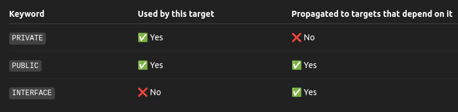

# Step 2

## `option()`

The signature of `option()` is
```cmake
option(<variable> "<help_text>" [value])
```

Notice that `"<help_text>"` is required while `value` is not required. So be careful and always assign `"<help_text>"` to each `<variable>` you declare. 

## Delving deeper in `option()`

When you don't initialize `USE_MYMATH` when calling `cmake ../Step2`, the `USE_MYMATH` variable will take in the last value it is assigned to. Why? Taking a look deeper on the documentation of `option()` [here](https://cmake.org/cmake/help/latest/command/option.html), it can be seen that the sentence that says: "*In CMake project mode, a boolean cache variable is created with the option value.*"

**Note**: Project mode is used to generate build systems for the project, while script mode is used to execute CMake commands directly from the script file. 

Then, let's go back to the documentation as well. Here is the signature for references: 
```cmake
option(<variable> "<help_text>" [value])
```

It stated that: *"If no initial `<value>` is provided, boolean OFF is the default value. If `<variable>` is already set as a normal or cache variable, then the command does nothing"*. So, even though you have implemented this in the code:
```cmake
option(USE_MYMATH "Use our own math implementation" ON)
```
It will check first whether `USE_MYMATH` is already set as a normal/cache variable or not. If so, then this command will do nothing and directly proceed with the value stored in the cache. This is why `USE_MYMATH` variable will take in the last value it is assigned to. 

## `target_compile_definitions()`

The signature of `target_compile_definitions()` is
```cmake
target_compile_definitions(<target> <scope> [items1...] [<scope> [items2...]]...)
```

The purpose of adding this is to tell the compiler to define preprocessor macros for `<target>`. Macros are usually defined by the `#define` directive. So, a clearer example is that when we use:
```cmake
target_compile_definitions(MathFunctions PRIVATE USE_MYMATH)
```
It is the same as writing `#define USE_MYMATH` at the top of every source file for each linked target. 

## Conditional Preprocessing 

Then, in the source file, there are some directives we can use to perform preprocessing. A full list of it can be found in the cppreference page, [here](https://en.cppreference.com/w/cpp/preprocessor/conditional). The ones that we are using in TODO 9 are `#ifdef`, `#else`, and `#endif`. 

In short, `#ifdef x` is use to check whether `x` is defined or not. On the other hand, `#ifndef` is use to check whether `x` is not defined or not, i.e., `#if !def` (the `n` is for **not**). 

## Differences between `PUBLIC`, `PRIVATE` vs `INTERFACE`

A really good explanation about this can be found [here](https://leimao.github.io/blog/CMake-Public-Private-Interface/). In short, I think this image below summarized it well. 

